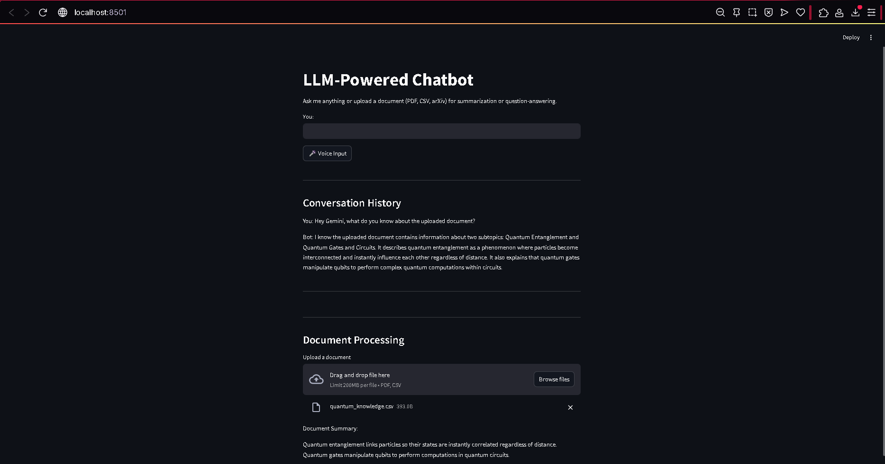

# LLM-Powered Chatbot Application

This project is a Streamlit application that leverages a large language model (LLM) powered by **Google Gemini (specifically the gemini-2.0-flash model)** to create an interactive chatbot. The chatbot supports question-answering and summarization of various document types, including PDF and CSV documents. It also features memory functionality to retain context during conversations, displays the entire conversation history, and includes **voice input** capability.



## Features

- **Question-Answering**: Ask questions based on document content.
- **Summarization**: Get summaries of uploaded documents.
- **Memory Functionality**: Chatbot remembers previous interactions.
- **Conversation History**: View the full conversation log.
- **Text Input**: Interact with the chatbot by typing your messages.
- **Voice Input**: Enables spoken interaction with the chatbot.
    - Speech-to-Text (STT): Powered by Whisper.
    - Text-to-Speech (TTS): Powered by Eleven Labs.
- **Google Gemini Integration**: Utilizes the `gemini-2.0-flash` model for LLM capabilities.

## Project Structure

```
llm-chatbot-app/
├── .git/                 # Git repository (hidden)
├── .gitignore            # Specifies intentionally untracked files
├── faiss_index/          # Directory for FAISS index
├── recordings/           # Directory for audio recordings and temporary files
├── README.md             # Project documentation
├── requirements.txt      # Project dependencies
└── src/
    ├── app.py          # Main Streamlit application file
    ├── chatbot/
    │   ├── chatbot.py      # Main chatbot logic
    │   ├── csv_handler.py    # Handles CSV file processing
    │   ├── memory.py         # Implements conversation memory
    │   ├── pdf_handler.py    # Handles PDF document processing
    │   ├── RAG.py            # Retrieval Augmented Generation logic (using Gemini)
    │   ├── STT.py            # Speech-to-Text functionality (using Whisper)
    │   └── TTS.py            # Text-to-Speech functionality (using Eleven Labs)
    └── utils/
        └── helpers.py      # Utility functions
```

## Installation

1. Clone the repository:
   ```
   git clone <repository-url>
   cd llm-chatbot-app
   ```

2. Install the required dependencies:
   ```
   pip install -r requirements.txt
   ```
   *Note: Ensure you have the necessary libraries for Google Generative AI installed. These should be included in requirements.txt.*

3. Obtain a Google Gemini API key and set it as an environment variable (e.g., `GOOGLE_API_KEY`).
4. Obtain an Eleven Labs API key and set it as an environment variable (e.g., `ELEVENLABS_API_KEY`).

## Usage

To run the Streamlit application, execute the following command:
```
streamlit run src/app.py
```

Open your web browser and navigate to `http://localhost:8501` to interact with the chatbot.

## Contributing

Contributions are welcome! Please feel free to submit a pull request or open an issue for any enhancements or bug fixes.

## License

This project is licensed under the MIT License. See the LICENSE file for more details.